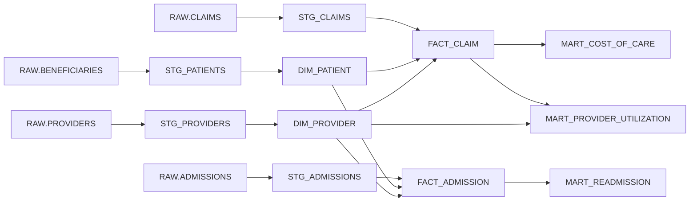
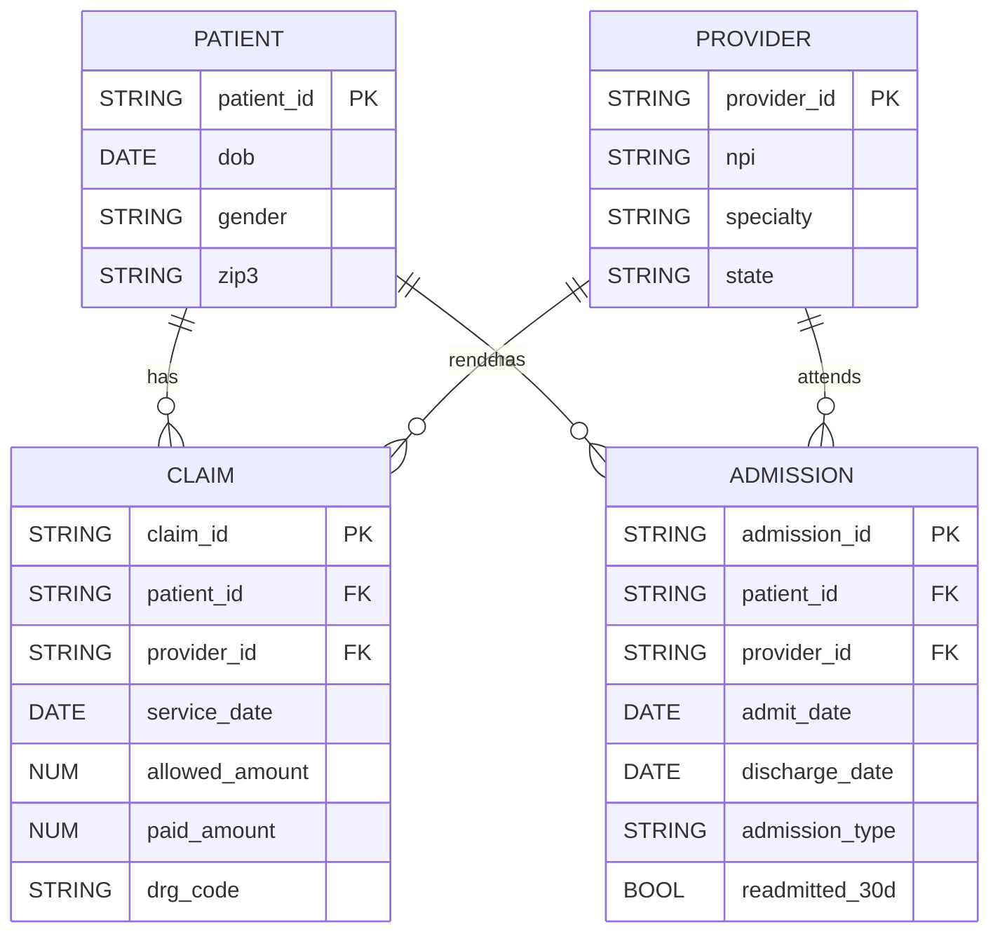

# MediFlow: Healthcare Data Integration & Analytics


## Introduction
MediFlow is an end-to-end data engineering project that demonstrates how to build **scalable, reliable, and tested pipelines** for healthcare-style datasets.  
Using **Airflow, dbt, and Snowflake**, MediFlow ingests publicly available **CMS Medicare data** and transforms it into a **dimensional schema** that powers downstream **analytics and machine learning use cases**.  

This project is designed to showcase best practices in:
- Orchestrating ingestion & transformation workflows  
- Ensuring reproducibility with testing and monitoring  
- Structuring messy healthcare-like datasets into usable marts  

## What We’re Doing
- **Ingesting**: Load publicly available CMS claims and provider datasets into Snowflake  
- **Transforming**: Apply dbt staging, dimensional models, and testing  
- **Modeling**: Structure the data into `FACT` and `DIM` tables  
- **Serving**: Expose marts for cost-of-care analysis, readmission patterns, and provider utilization  
- **Monitoring**: Validate pipelines with tests, lineage tracking, and alerting  

## Why This Project
Healthcare data is notoriously **complex, messy, and regulated**. Building reliable pipelines is essential for:  
- Reducing time-to-insight for analysts and data scientists  
- Ensuring reproducibility and compliance with data standards  
- Supporting critical use cases like **readmission prediction**, **claims cost tracking**, and **provider benchmarking**  

MediFlow shows how modern data engineering tools can **bridge the gap** between raw healthcare datasets and actionable insights.

---

## How It Works

### High-level Architecture
```mermaid
flowchart LR
  subgraph Sources[Public Healthcare Data Sources]
    CMS[CMS Medicare PUFs / SynPUFs]
    NPI[NPI Registry / Provider Files]
  end

  CMS -->|CSV/Parquet| Ingest[Airflow Ingestion DAG]
  NPI -->|CSV/JSON| Ingest

  Ingest --> RAW["Snowflake RAW (landing)"]
  RAW --> STG[dbt Staging Models]
  STG --> CORE["dbt Core Models (DIM, FACT)"]
  CORE --> MARTS["Analytics Marts (Cost, Readmission, Utilization)"]
  MARTS --> BI[BI Tools / Notebooks / ML]

  subgraph Platform[Platform & Quality]
    TESTS["Data Quality & Freshness (dbt tests)"]
    ALERTS["Alerts (Email/Slack)"]
    LINEAGE["Lineage (Airflow + dbt docs)"]
  end

  STG --- TESTS
  CORE --- TESTS
  Ingest --- ALERTS
  CORE --- LINEAGE
````

### Airflow Workflow

```mermaid
flowchart LR
  start([Schedule / Trigger])
  check{{Check Source Availability}}
  load([Load to Snowflake RAW])
  audit([Row Counts & Schema Audit])
  dbt_seed["dbt seed refs/lookups"]
  dbt_stg[dbt run --select stg]
  dbt_core[dbt run --select dim+,fact+]
  dbt_test[dbt test schema, freshness, custom]
  publish([Build marts & grant access])
  success([DAG Success])
  onfail([Alert & retry policy])

  start --> check --> load --> audit --> dbt_seed --> dbt_stg --> dbt_core --> dbt_test --> publish --> success
  dbt_test -->|fail| onfail
```

### dbt Lineage (Staging → Marts)


### Data Model (ERD)



---

## Getting Started

### 1. Prerequisites

* [Python 3.9+](https://www.python.org/)
* [Docker & Docker Compose](https://docs.docker.com/get-docker/)
* [Airflow](https://airflow.apache.org/) (run via Docker or Astronomer)
* [dbt Core](https://docs.getdbt.com/docs/core)
* [Snowflake account](https://signup.snowflake.com/) (free trial works)
* Public healthcare dataset (e.g., [CMS SynPUF](https://www.cms.gov/data-research/statistics-trends-and-reports/medicare-claims-synthetic-public-use-files))

### 2. Clone the Repository

```bash
git clone https://github.com/KayvanShah1/mediflow.git
cd mediflow
```

### 3. Environment Variables

Create a `.env` file with your credentials:

```env
SNOWFLAKE_ACCOUNT=<your-account>
SNOWFLAKE_USER=<your-user>
SNOWFLAKE_PASSWORD=<your-password>
SNOWFLAKE_ROLE=ACCOUNTADMIN
SNOWFLAKE_WAREHOUSE=COMPUTE_WH
SNOWFLAKE_DATABASE=MEDIFLOW
SNOWFLAKE_SCHEMA=RAW
```

### 4. Spin Up Airflow

```bash
docker-compose up airflow-init
docker-compose up
```

Navigate to: [http://localhost:8080](http://localhost:8080)

### 5. Run dbt Models

```bash
cd dbt_project
dbt debug
dbt run
dbt test
```

### 6. Verify Outputs

* Snowflake should contain tables in `RAW`, `STG`, `DIM`, and `FACT` schemas
* dbt docs available with:

```bash
dbt docs generate
dbt docs serve
```

* Analytics marts (e.g., cost-of-care, readmission) are queryable in BI tools or notebooks

## Example Analytics Marts

* **MART_COST_OF_CARE** → Claims cost by patient cohort and provider
* **MART_READMISSION** → 30-day readmission rates by hospital and diagnosis
* **MART_PROVIDER_UTILIZATION** → Utilization patterns by specialty and geography

---

## Authors

* **Kayvan Shah** – Data & ML Engineer
* Contributions welcome via pull requests!

## License

This project is licensed under the **MIT License** – see the [LICENSE](LICENSE) file for details.


### Disclaimer

This project uses **publicly available and synthetic datasets (e.g., CMS PUFs, SynPUFs)**.
It is intended **solely for educational and demonstration purposes**.
No personally identifiable or sensitive patient information is used in this project.
